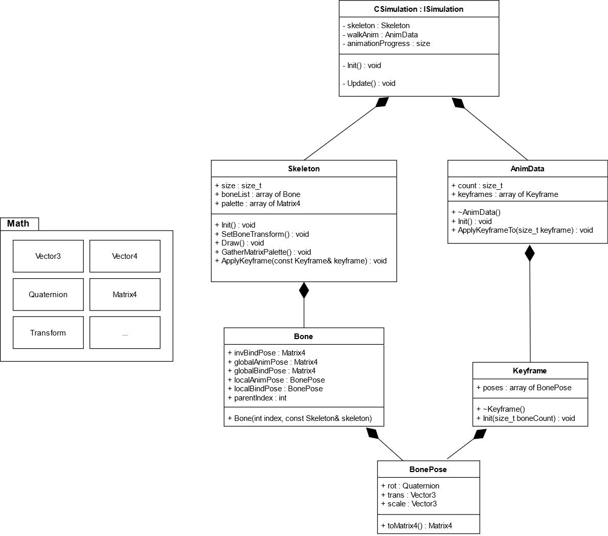

# Animation programming
by Sami AMARA and William NARDONE

## Running the project
Launching `Release/AnimationProgramming.exe` will run the project.
Alternatively, you can open the solution (`AnimationProgramming.sln`) and press F5.
Finally, you can :
1. Open the solution (`AnimationProgramming.sln`)
2. In the solution explorer, left click "AnimationProgramming" under "Solution 'AnimationProgramming'"
3. Click "Build"
4. Wait for the generation to be over
5. Launch `Release/AnimationProgramming.exe`

`Release/AnimationProgramming.exe` will sometimes close shortly after being launched. The model may also not appear sometimes.
The same goes with the Local Windows Debugger in Visual Studio. Some errors may be displayed in the console, or in the editor,
but these problems comes from the underlying engine. Check the screenshot/video folder (`Docs/Screenshots`) to see working examples.

## What is and is not done
- [X] Draw the skeleton with lines using DrawLine (a little in front of the character in order to see the lines) (tag `skeleton_drawing`)
- [X] Move a bone manually (`move_bone` tag)
- [X] Code the hardware skinning so that the vertices follow the bones (send the transformations of the bones with the SetSkinningPose function in Engine.h) (tag `hardware_skinning`)
- [X] Display the first keyframe of the walk animation on the character (tag `first_keyframe_pose`)
- [X] Make the character play the running animation by hard switching from keyframe to keyframe (`raw_animation` tag)
- [] Interpolate the keyframes so that the animation is smooth
- [] Blend the walking and running animations, controlling the game speeds of the 2 animates so that they are always synchronized (that they have the same normalized time)

The aformentioned finished versions can be checkout out with `git checkout <tag>`.
The final version is tagged `GOLD`.

## Architecture

- `AnimationProgramming/` contains sources and Visual Studio's solution explorer files
- `AnimationProgramming/Math/` has all the sources for the math used throughout this project
- `AnimationProgramming/Animation/` has all animation related sources added to the original project
- `Docs/` contains screenshots, videos, and the architecture illustrated
- `Release/` holds the binary contents and data used in the project

*You can find this picture in Docs/*